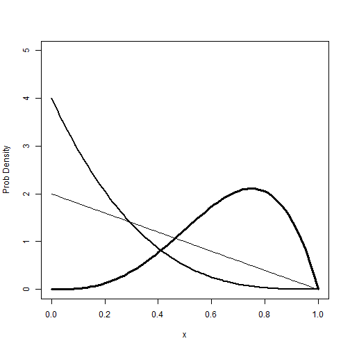
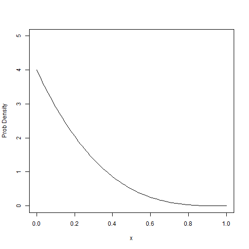

# Toward a GUI about Likelihood


```r
x <- seq(0, 1, length = 101)
plot(1:2, ylim = c(0, 5), xlim = c(0, 1), xlab = "x", ylab = "Prob Density", 
    type = "n")
lines(x, dbeta(x, shape1 = 1, shape2 = 2), lwd = 1)
lines(x, dbeta(x, shape1 = 1, shape2 = 4), lwd = 2)
lines(x, dbeta(x, shape1 = 4, shape2 = 2), lwd = 3)
```

 


```r
drawBeta <- function(shape1, shape2, ...) {
    plot(1:2, ylim = c(0, 5), xlim = c(0, 1), xlab = "x", ylab = "Prob Density", 
        type = "n")
    lines(x, dbeta(x, shape1 = shape1, shape2 = shape2), ...)
}
```


```r
drawBeta(shape1 = 1, shape2 = 4)
```

 


```r
BetaApp <- function() {
    manipulate({
        drawBeta(a, b, col = color, lwd = thickness)
        points(pts, rep(0, length(pts)))
    }, a = slider(0, 10, initial = 1, label = "a", step = 0.2), b = slider(0, 
        10, initial = 2, label = "b", step = 0.2), color = picker(list("blue", 
        "green", "red", "purple", "orange", "gold", "magenta")), thickness = picker(list("1", 
        "2", "3", "4")))
}
```

