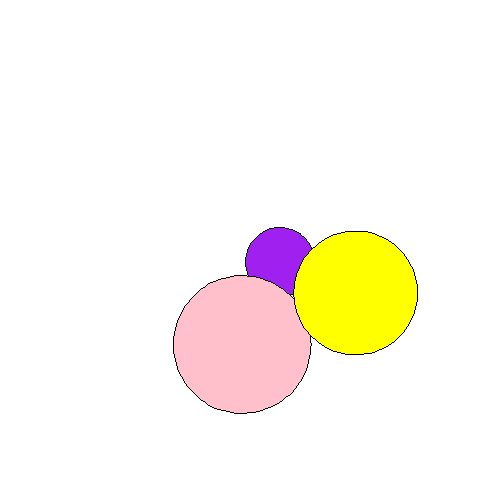
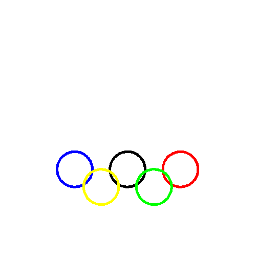

Functions and Graphics 
========================================================

## countOdds Function

```r
countOdds <- function(x) {
    b <- 0
    for (k in x) {
        if (k%%2 == 1) 
            b <- b + 1
    }
    return(b)
}
```


## Examples

```r
countOdds(1:9)
```

```
## [1] 5
```

```r
countOdds(c(3, 5, 7))
```

```
## [1] 3
```

```r
countOdds(c(3, 5, 7, 6, 2, 0))
```

```
## [1] 3
```


## countEvens Function

```r
countEvens <- function(x) {
    b <- 0
    for (k in x) {
        if (k%%2 == 0) 
            b <- b + 1
    }
    return(b)
}
```


## Examples

```r
countEvens(2:50)
```

```
## [1] 25
```


## hypotenuseLength Function

```r
hypotenuseLength <- function(x, y) {
    h <- sqrt(x^2 + y^2)
    return(h)
}
```


## Examples

```r
hypotenuseLength(3, 4)
```

```
## [1] 5
```

```r
hypotenuseLength(13, 84)
```

```
## [1] 85
```


## lawOfCosines Function

```r
lawOfCosines <- function(a, b, theta) {
    c <- (a^2) + (b^2) - (2 * a * b) * cos(theta)
    return(sqrt(c))
}
```


## Examples

```r
lawOfCosines(13, 84, pi/2)
```

```
## [1] 85
```

```r
lawOfCosines(13, 84, 0)
```

```
## [1] 71
```

```r
lawOfCosines(5, 5, pi/3)
```

```
## [1] 5
```


## thetaFromLengths Function

```r
thetaFromLengths <- function(a, b, c) {
    m <- (c^2) - (a^2) - (b^2)
    n <- m/(-2 * a * b)
    p <- acos(n)
    return(p)
}
```


## Examples

```r
thetaFromLengths(3, 4, 5)
```

```
## [1] 1.571
```


## thetaFromLengthsTest Function

```r
thetaFromLengthsTest <- function(a, b, theta) {
    c <- (a^2) + (b^2) - (2 * a * b) * cos(theta)
    c <- sqrt(c)
    m <- (c^2) - (a^2) - (b^2)
    n <- m/(-2 * a * b)
    p <- acos(n)
    final <- p - theta
    return(final)
}
```


## Example

```r
thetaFromLengthsTest(13, 84, pi/2)
```

```
## [1] 0
```


## canvas

```r
canvas <- function(min = 0, max = 100) {
    plot(0, ylim = c(0, 100), xlim = c(0, 100), type = "n", xaxt = "n", yaxt = "n", 
        xlab = "", ylab = "", bty = "n", asp = 1)
}
```


## drawCircle

```r
drawCircle <- function(x, y, r, ...) {
    angs <- seq(0, 2 * pi, length = 100)
    xpts <- x + r * cos(angs)
    ypts <- y + r * sin(angs)
    circle <- polygon(xpts, ypts, ...)
    return(circle)
}
```


## Overlapping Circles

```r
canvas(0, 100)
drawCircle(54, 45, 10, col = "purple", border = NULL)
```

```
## NULL
```

```r
drawCircle(43, 21, 20, col = "pink", border = NULL)
```

```
## NULL
```

```r
drawCircle(76, 36, 18, col = "yellow", border = NULL)
```

 

```
## NULL
```


## Olympic Logo

```r
canvas(0, 100)
drawCircle(15, 25, 10, col = "transparent", border = "blue", lwd = 5)
```

```
## NULL
```

```r
drawCircle(45, 25, 10, col = "transparent", border = "black", lwd = 5)
```

```
## NULL
```

```r
drawCircle(75, 25, 10, col = "transparent", border = "red", lwd = 5)
```

```
## NULL
```

```r
drawCircle(30, 15, 10, col = "transparent", border = "yellow", lwd = 5)
```

```
## NULL
```

```r
drawCircle(60, 15, 10, col = "transparent", border = "green", lwd = 5)
```

 

```
## NULL
```

