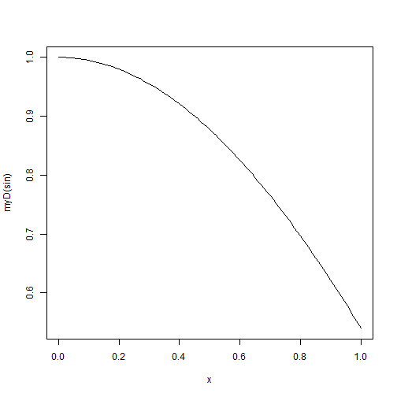
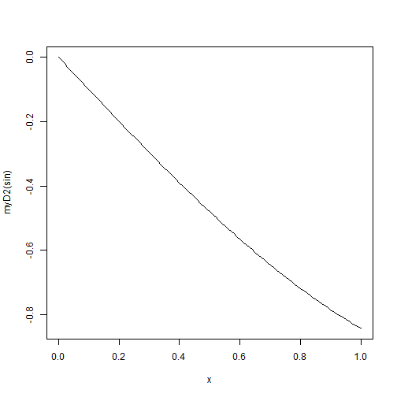

Derivatives as Finite Differences
========================================================

## First Derivative

```r
myD <- function(f) {
    h <- 0.001
    fprime <- function(x) {
        (f(x + h) - f(x))/h
    }
    return(fprime)
}
```


```r
plot(myD(sin))
```

 


## Second Derivative

```r
myD2 <- function(f) {
    h <- 0.001
    fprime <- function(x) {
        (f(x + h) - f(x))/h
    }
    ddx <- function(x) {
        (fprime(x + h) - fprime(x))/h
    }
    return(ddx)
}
```


```r
plot(myD2(sin))
```

 


## Alternate Second Derivative

```r
altmyD2 <- function(f) {
    h <- 0.001
    fprime <- myD(f)
    fprime2 <- myD(fprime)
    return(fprime2)
}
```


```r
plot(altmyD2(sin))
```

 

